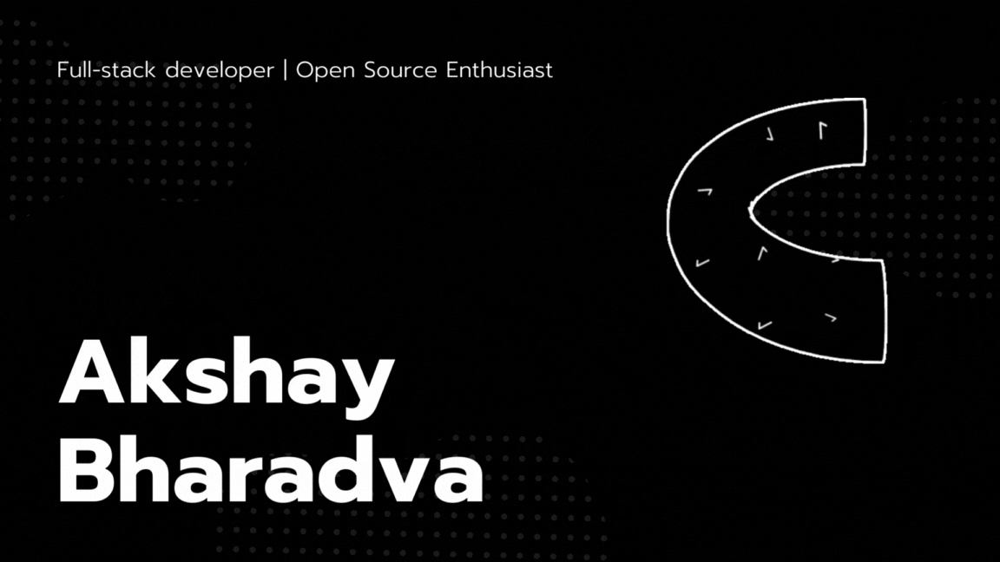

<!--
Here are some ideas to get you started:
- 🔭 I’m currently working on ...
- 🌱 I’m currently learning ...
- 👯 I’m looking to collaborate on ...
- 🤔 I’m looking for help with ...
- 💬 Ask me about ...
- 📫 How to reach me: ...
- 😄 Pronouns: ...
- ⚡ Fun fact: ...
-->
<!-- 

  

 -->

 

## Hey 👋, I'm Akshay Bharadva, Full stack developer

### A Fullstack Developer, Reader, and Good Friend!

- 🔭 I just deployed my portfolio: [Akshay Bharadva](https://akshay-bharadva.github.io/)!
- 🌱 I’m currently learning 🐍 `hello-world.py`, and about to finish [`CS50P`](https://cs50.harvard.edu/python/2022/)
- 😄 Pronouns: He/Him
- 🤔 I’m looking for help with my career. <!-- and love-life. -->
- 👯 I’m looking to collaborate with other developers or open-source developers and organizations.
- 🥅 Goals: Contribute more to Open Source projects | Stay alive
- ⚡ Fun fact: I love to play games on Mobile and PC and I'm a very bad chef coz I hate cooking.
- 📫 How to reach me: [Akshay Bharadva](https://www.linkedin.com/in/akshay-bharadva/)

 

<!-- <h2 align="center">Tech Stack</h2>

 
  &nbsp;
 
  &nbsp;
 
  &nbsp;
 
  &nbsp;
  
  &nbsp;
 
  &nbsp;
 
  &nbsp;
 
  &nbsp;
 
  &nbsp;

 -->

<!-- 

 
  &nbsp;
 
  &nbsp;
 
  &nbsp;
 
  &nbsp;
 

 -->

<!--   -->

<!-- <h2 align="center">Tool I Use</h2>

 
  &nbsp;
 
  &nbsp;
 
  &nbsp;
 

 -->

<!--   -->

<!-- 

  

 -->

 

<!-- 

  

 -->

<!--   -->

<!-- 

  

 -->

<!--   -->

Show some 💙 by starring some of the repositories!

